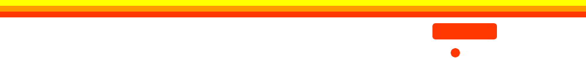
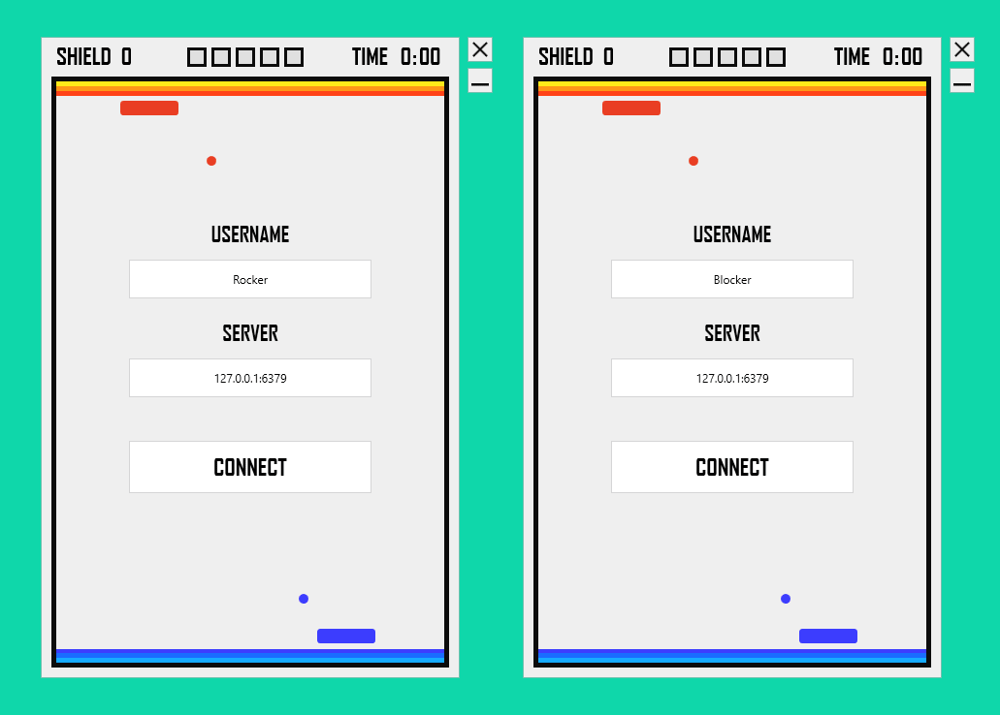

# BreakTime
Breakout style game for 2 players using redis server.

## Features
- Server system able to host up to 3 live matches (6 players)
- Client application optimized for displaying server changes and sending player inputs

## Gameplay
- Defend your wall againts enemy player
- Break blocks to upgrade shields
- Upgrade your defender with powerups
- Beat 3/5 matches to win



## Requirements
#### Server
- redis-cli (for local hosting)
- .NET Framework 4.6.1

#### Client
- .NET Framework 4.6.1

## Project Setup
#### Server
1. To host matches locally, start the Redis server by running:
```console
sudo service redis-server restart
```
2. Build the server project
3. Run Server.exe where you builded the project
4. Input IP or URL of redis host like this:
```console
127.0.0.1:6379
```
5. Click START

#### Client
1. Build the client project
2. Run Client.exe where you builded the project (twice if you want to test without second player)
3. Change Username
4. Input IP or URL of redis host like this:
```console
127.0.0.1:6379
```
5. Click CONNECT


